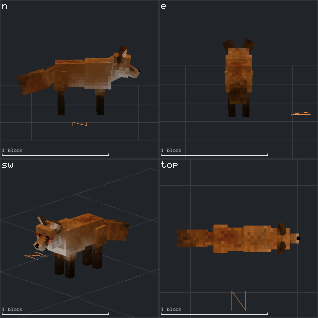

# vs-shapes-mcp

An MCP server that lets an LLM agent open, inspect, edit, animate, validate, and **render**
[Vintage Story](https://www.vintagestory.at/) shape files. This is v1 of **Menagerie**
([SPEC.md](SPEC.md)): the agent is the bookkeeper, the human is the taste function.



## What it does

- **Lossless document model** — shape JSON parses into a tree that remembers every number
  literal and layout choice. Unedited files re-serialize **byte-identically** (verified
  against all 6,115 vanilla shapes: 99.7% overall, 100% of `shapes/entity/**`; the misses
  are comment-bearing block files). Edits produce model-creator-style output, so diffs
  against vanilla stay readable and files round-trip through the official Model Creator.
- **Engine-faithful kinematics** — element transforms and keyframe interpolation are exact
  ports of the decompiled engine code (rotation order, both `animVersion` composition modes,
  per-channel wraparound lerp). See [docs/GROUND-TRUTH.md](docs/GROUND-TRUTH.md) and
  [docs/ground-truth/](docs/ground-truth/) for the facts with decompile citations.
- **Headless rendering** — compass-named orthographic views and animation filmstrips as PNG,
  with the game's face shading, nearest-neighbor texturing from the installed game assets,
  ground grid, and scale bar. Two backends: **WebGPU** (Dawn) and a pure-JS **software**
  rasterizer (automatic fallback; byte-deterministic, used for golden tests).
- **Validation suite** — every engine landmine as an explicit check: dangling keyframe
  references after renames, `quantityframes` overflow (engine throws), partial channel
  triples (engine NPEs), UV out-of-bounds, joint-cap warnings, loop-wrap snaps, foot slide.
- **Corpus access** — search and stat the installed game's vanilla shapes, open them as
  starting points, kitbash subtrees between documents (`element_import`).

## Setup

```sh
npm install
npm run build
```

Register with Claude Code (project scope):

```json
// .mcp.json
{
  "mcpServers": {
    "vs-shapes": { "command": "node", "args": ["dist/index.js"] }
  }
}
```

```
vs-shapes-mcp [--game-path <dir>] [--renderer <webgpu|software|auto>]
```

The game install is auto-discovered (`--game-path` → `VINTAGE_STORY` env →
`%APPDATA%/Vintagestory`). Without an install the server still edits and validates;
corpus tools error clearly and renders fall back to deterministic flat colors.

## Tools (44)

| Group | Tools |
|---|---|
| Lifecycle | `shape_open` (file or `corpus:` path), `shape_create`, `shape_save`, `shape_close`, `shape_list_open` |
| History | `doc_undo`, `doc_redo`, `doc_history` |
| Query | `shape_describe`, `shape_measure`, `shape_find` |
| Geometry | `element_add`, `element_edit`, `element_rename` (cascades into keyframes), `element_reparent`, `element_mirror`, `element_scale`, `element_delete`, `element_duplicate`, `element_import` |
| Animation | `anim_list`, `anim_describe`, `anim_create`, `anim_delete`, `anim_edit_meta`, `anim_set_keyframe`, `anim_delete_keyframe`, `anim_adjust`, `anim_retime`, `anim_mirror_phase` |
| UV / faces | `uv_report`, `uv_set_face`, `uv_auto` (incremental with `elements`), `face_set` (bulk texture/glow/enabled) |
| Perception | `render_views`, `render_filmstrip`, `render_gif` (looping animation; all export to disk via `savePath`), `palette_extract` (texture colors → ranked palette) |
| Validation | `validate_run` (also runs after every mutation) |
| Corpus | `corpus_search`, `corpus_describe` |
| Escape hatch | `doc_get_json`, `doc_patch_json` (RFC 6902, transactional, fully validated), `doc_script` (sandboxed procedural mutation) |

Conventions the tools document in their schemas: geometry units are 1/16 block; north = −Z;
**vanilla creatures face west (−X)**, so the `n` render view shows a side profile; view names
are the compass side the camera looks at.

**Stateless mode (subagent workflows):** every `docId` param also accepts a shape `.json`
file path or a `corpus:` ref — no `shape_open`/`shape_save` handshake. Path-addressed
documents open on demand and every mutation auto-saves back to the file (the response
carries `savedTo`); the file is re-read when it changed on disk, so parallel agents — even
separate server processes — compose at call granularity instead of clobbering each other.
`corpus:` refs are read-only; `shape_save` with a `corpus:` ref and a `path` is the
one-call vanilla-shape→file export, and `element_import` takes them as `fromDocId` for
kitbashing.

## Development

```sh
npm test            # full suite incl. corpus round-trip + GPU/software parity (skips gracefully without a game install)
npm run typecheck
npm run dev         # tsx src/index.ts
```

Notes:

- A connected MCP session runs the `dist/` it was launched with — after changing `src/`,
  `npm run build` and restart the session (or client) to pick the changes up.
- Library consumers of `render/views.js` should `process.exit()` when done (or avoid the
  GPU backend with `renderer: 'software'`): the Dawn device keeps the event loop alive.

Architecture and module contracts: [docs/ARCHITECTURE.md](docs/ARCHITECTURE.md).
Engine semantics with decompile citations: [docs/GROUND-TRUTH.md](docs/GROUND-TRUTH.md),
[docs/ground-truth/tesselator.md](docs/ground-truth/tesselator.md),
[docs/ground-truth/format-empirics.md](docs/ground-truth/format-empirics.md).

## Not in v1 (see SPEC.md)

Texture compiler and UV broker (§6, §6a), parametric animation templates (§7), entity JSON
scaffolding and mod packaging (§11), the variant-grid web UI (§9), scripting sandbox (§4a
ring 1). The escape hatch (`doc_patch_json`) covers gaps in the meantime.
